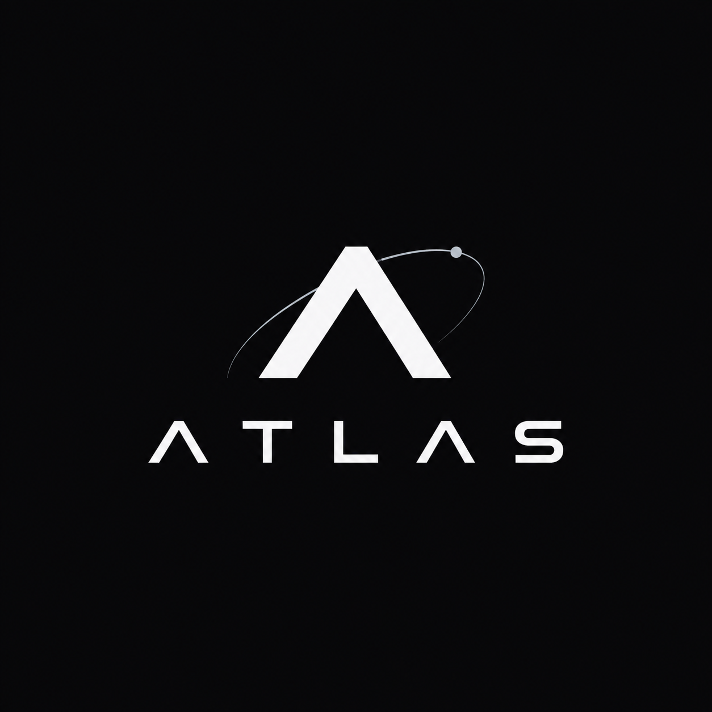

<p align="center">
  
</p>

# Atlas

Atlas é uma plataforma de inteligência pessoal residente e local-first, criada para compreender, operar e evoluir o ambiente digital do usuário.

Não é apenas um chatbot ou copiloto. O objetivo é ser uma camada operacional persistente entre o usuário, seus computadores, aplicações, serviços, conhecimento e dispositivos.

> **Atlas é uma inteligência residente para o ambiente digital do usuário.**

A visão técnica completa está em [`docs/ATLAS_TECHNICAL_VISION.md`](docs/ATLAS_TECHNICAL_VISION.md).

## Estado atual

A implementação atual usa TypeScript/ESM, OpenAI Agents SDK e OpenCode Go. O projeto evolui incrementalmente em direção à arquitetura descrita na visão técnica, incluindo discovery progressivo, tools, skills, memória, tasks/workers, runtime local-first e clientes desacoplados.

## Requisitos

- Node.js 22 ou superior
- Uma chave do OpenCode Go

## Instalação

```bash
npm ci
```

Configure a chave no ambiente:

```bash
export OPENCODE_GO_API_KEY="sua-chave"
```

## Uso

```ts
import { runAtlas } from './dist/index.js';

const result = await runAtlas('Explique este projeto.', {
  conversationId: 'conversation-123',
});

console.log(result.finalOutput);
```

Use o mesmo `conversationId` para preservar o contexto entre turns. Um ID diferente cria uma conversa independente.

## Comandos

```bash
npm run dev
npm run build
npm test
npm run smoke
```

Para executar todos os checks de qualidade:

```bash
npm run format:check
npm run lint
npm run typecheck
npm test
npm run smoke
```

Consulte [`docs/build.md`](docs/build.md) para o fluxo completo de build, validação e CI.

---

<p align="center">
  
</p>
